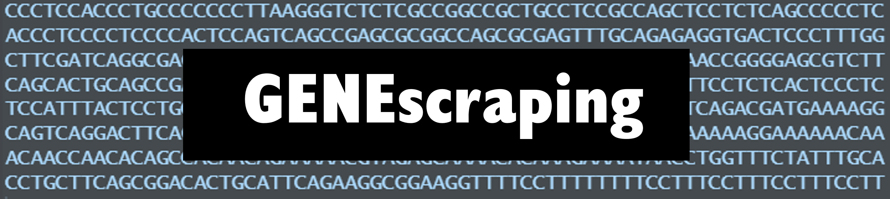
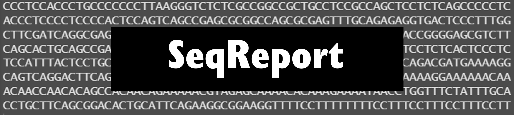

  

R packages developed by Raquel Pinho.

<figure class="half">

</figure>

<table border="0">
 <tr>
    <td><b style="font-size:20px">GENEscraping</b></td>
    <td><b style="font-size:20px">SeqReport</b></td>
 </tr>
 <tr>
    <td>This is a package you can use to retrieve fasta sequences from NCBI database, according to a data.frame containing genomic coordinates. It also allows the flexibility of changing the size of the sequence and adding tags for the design of rhAmpSeq primers panels. The package also have functions to write the fasta sequences into separated or combined fasta files.</td>
    <td>This is a package you can use to combine reports of sequencing quality control and alignment with bowtie2 or BWAMEM from multiple samples into one data.frame with the option of data visualization in a single plot. This facilitates the comparison between samples, between processing steps (before/after trimming) and to compare different software/parameters.</td>
 </tr>
 <tr>
    <td><a href="https://github.com/RaquelPinho/GENEscraping" class="btn zoombtn">Read More</a></td>
    <td><a href="https://github.com/RaquelPinho/SeqReport" class="btn zoombtn">Read More</a></td>
 </tr>
</table>

